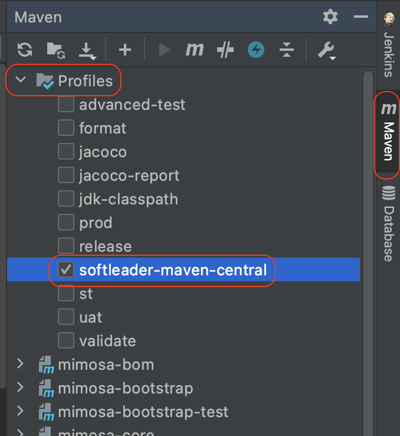

# mimosa-fcb-framework
A Kubernetes Native Java stack tailored for FCB mid-platform standards

| Dependencies | version | Reference |
| ------------- | ------------- | ------------- |
| Java | 11  | [API](https://docs.oracle.com/en/java/javase/11/docs/api/index.html) |
| Spring Boot | 2.3.x | [Reference](https://docs.spring.io/spring-boot/docs/2.3.3.RELEASE/reference/html/) • [API](https://docs.spring.io/spring-boot/docs/2.3.3.RELEASE/api/) |
| Spring Cloud | Hoxton | [Reference](https://cloud.spring.io/spring-cloud-static/Hoxton.RELEASE/reference/html/spring-cloud.html) • [API](https://spring.io/projects/spring-cloud) |
| Spring Cloud Kubernetes | 1.1.x | [Reference](https://cloud.spring.io/spring-cloud-static/spring-cloud-kubernetes/1.1.1.RELEASE/reference/html/) • [API](https://cloud.spring.io/spring-cloud-static/spring-cloud-kubernetes/1.1.1.RELEASE/reference/html/) |
| Maven | 3.6.x | [Reference](https://maven.apache.org/ref/3.6.2/) |

## Getting Started

<details>
<summary><b>Profile</b></summary><br>

為了避免是使用 Mimosa Framework 的下層專案被強制指定 maven 的 repository url,
因此跟松凌有關的 repository 設定都收錄在 `softleader-maven-central` profile 中,
松凌開發 Framework 的成員請記得所有 maven 指令都要啟用 profile, 如:

``` bash
mvn -Psoftleader-maven-central compile package ... 
```

在 IDE 中也記得要設定, IntelliJ 的設定如下:

</details>

<details>
<summary><b>進版</b></summary><br>

``` bash
mvn -Psoftleader-maven-central versions:set -DnewVersion=<new-version>
mvn -Psoftleader-maven-central versions:commit
```

> `<new-version>` 可以從 [pom.xml](./pom.xml#L9) 中看到找到當前版本 +1
</details>

<details>
<summary><b>發佈</b></summary><br>

``` bash
mvn -Psoftleader-maven-central deploy -e -DskipTests
```

啟動 `softleader-maven-central` profile 預設都會發佈到松凌的 nexus 中,
若想要發佈到特定的 nexus (如客戶環境的 nexus), 可以透過以下指令傳入 url:

```bash
mvn -Psoftleader-maven-central deploy \
-D'softleader.releases.repository=<releases-repository-url>' \
-D'softleader.snapshots.repository=<snapshots-repository-url>'
```
</details>

<details>
<summary><b>Makefile</b></summary><br>

如果你的系統支援 Makefile, 你可以透過 `make` 較方便的執行以上指令

```bash
# 顯示所有指令及說明
make help
```
</details>
